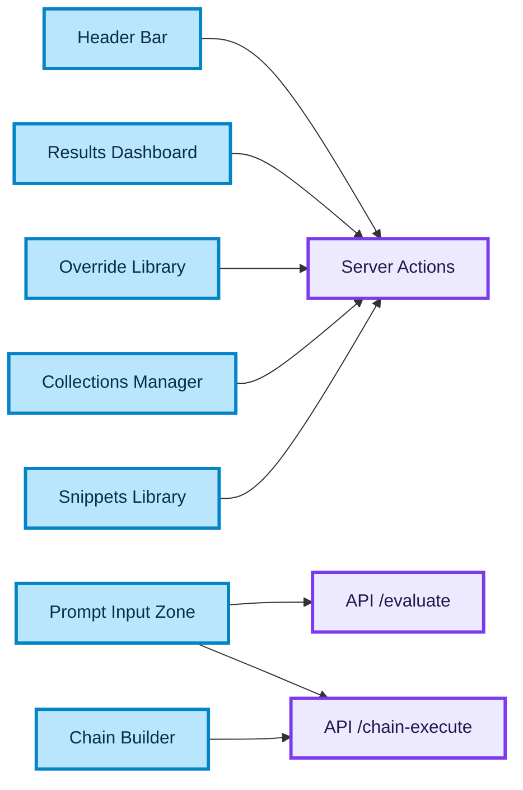
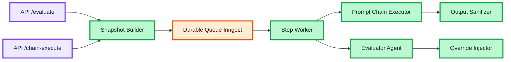
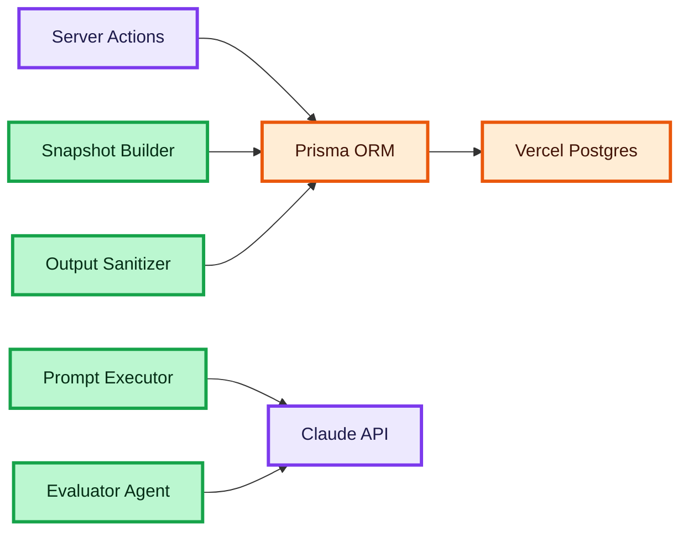

# Myrilo AI — Implementation Plan (v4)

> [!NOTE]
> **Version 4** — Integrated full [FEATURE_ROADMAP.md](file:///Users/elinadzhelilova/Local_Work/myriloai/docs/FEATURE_ROADMAP.md) (MVP-1 — MVP-8). Design system updated to: **Dual-Theme Cyan-Sky-Violet Aurora** (dark + light, OS auto-detect + manual toggle). Previous architecture (v3) is fully preserved.

## User Review Required

> [!IMPORTANT]
> **Key changes from v3:**
>
> 1. **Design**: Terminal Hacker (#0D1117 + #39FF14) → **Cyan-Sky-Violet Aurora** (dual theme)
> 2. **Features**: Added MVP-6 (Collections), MVP-7 (Categories), MVP-8 (Snippets)
> 3. **Phases**: Restructured (new features = new phases)
> 4. **Themes**: Dark-first → **dual theme** with `[data-theme]` + `prefers-color-scheme` + `localStorage`
> [!WARNING]
> **Open Questions:**
>
> 5. **Prisma schema**: MVP-6 (Collections) and MVP-7 (Categories) require new models — `Collection`, `CollectionPrompt`, `Category`, `PromptSnippet`. Are we ready to expand?
> 6. **MVP order**: FEATURE_ROADMAP indicates "build in order MVP-1 through MVP-8". But MVP-6/7/8 don't depend on the Evaluation Engine — can we parallelize?
> 7. **Pixelify Sans**: The previous plan used a retro font for the logo. In the new Aurora style — **do we keep it** as a brand accent, or switch to Inter 800 with gradient text?

---

## PART I: Analysis & Concept

### 1. Current Project State Analysis

| Component | Current State |
| --- | --- |
| **Next.js** | v16.2.9 with App Router, running on port 8080 |
| **Prisma** | v7.8.0 with PostgreSQL, base schema: `User`, `Account`, `Session` |
| **NextAuth.js** | v4.24.14 with GitHub Provider, JWT sessions |
| **UI** | Cyan-Sky-Violet Aurora |
| **Data** | Static JSON file `output.json` |
| **Design Research** | ✅ 4 reports ready (design-research, brainstorm, quick-references) |

---

### 2. System Architecture

The architecture is divided into three main parts for better visibility of data flows and module interactions.

#### 2.1. Presentation & Routing Layer

Responsible for the user interface and routing requests to the backend.



#### 2.2. Core Evaluation Engine Flow

Orchestration and execution of prompt evaluation.



#### 2.3. Data Storage & External Integrations

Interaction with the database and external APIs.



---

## 3. Code Quality, Tooling & 2026 Best Practices

### Tooling

- **Biome**: Used as the primary linter and formatter. All Biome rules must be strictly followed.
- **Knip**: Used for continuously finding and removing dead code, unused dependencies, and exports.
- **SonarQube**: Will be added for static code analysis, finding vulnerabilities, and code smells.
- **Shadcn UI**: Install and use Shadcn UI components to speed up development and ensure interface consistency (in the Aurora Glass style).

### Markdown & Documentation Standards

> Generates documentation with full markdown formatting and mermaid diagrams, ready to be pasted into a .md file.

**When to use:** editing documentation, schemas, architectural diagrams in a single block, ready to be saved.  
**Problem it solves:** an inner ` ```mermaid ` breaks the outer ` ```markdown ` block — use 4 backticks for the outer block.

**Documentation rules:**

- Identical H1 headers (`#`) at the beginning — document title.
- All other headers must be H2 (`##`) or H3 (`###`).
- Separate each section with a horizontal line (`---`).
- Use plain lists (`-`) — no nested bullet walls.
- Paragraphs should be short and direct.

**Code blocks:**

- Use ` ```mermaid ` for diagrams.
- Use ` ```text ` for plain text examples or rules.
- Use the correct language tags: ` ```typescript `, ` ```python `, ` ```bash `, etc.
- Never use code blocks without tags.

**Mermaid diagram rules:**

- Use `flowchart TD` or `flowchart LR`.
- Style all nodes using `classDef` (fill, stroke, stroke-width, color).
- Assign each logical group its own class.
- After the diagram, add a `## Legend` section with a table:

  | Color | Meaning |
  | :--- | :--- |
  | 🔵 Blue | ... |
  | 🟣 Purple | ... |

**Color palette for classDef (use consistently):**

- **Purple** (`#ede9fe` / `#7c3aed` / `#1e1b4b`) — server / infrastructure
- **Blue** (`#bae6fd` / `#0284c7` / `#082f49`) — client / UI layer
- **Orange** (`#ffedd5` / `#ea580c` / `#431407`) — state / cache / data
- **Green** (`#bbf7d0` / `#16a34a` / `#052e16`) — logic / services / actions
- **Red** (`#fee2e2` / `#dc2626` / `#450a0a`) — failure / rollback

### React & Next.js Best Practices (2026)

- **Design Patterns**: Adhere to current design patterns for 2026 (App Router conventions, Server Actions, Server Components by default).
- **React State**: Strictly **avoid calling `setState` inside `useEffect`** to prevent unnecessary renders. Use Server Components to fetch data, or React 19 hooks (`use`, `useActionState`).
- **Accessibility (a11y)**: Must add accessibility tags (ARIA labels, roles, `tabIndex`) to all interactive elements.
- **TypeScript Strictness**:
  - Strictly **avoid using the `any` type**. All data must be explicitly typed.
  - Mandatory and correct **import sorting** (via Biome/ESLint settings).

---

## 4. Execution Workflow (Batch Execution)

According to the new requirements, execution of the plan happens strictly **in batches**:

1. Work is done one sub-item at a time (e.g., "1.1. Shadcn UI Installation").
2. The agent makes changes **only** for this sub-item and stops.
3. At the end of each message, the agent offers the user two options:
   - **Option 1:** Discuss changes (user reviews, asks questions, agent makes fixes).
   - **Option 2:** Move to the next sub-item.
4. The agent does not move to the next sub-item without the user's explicit permission.

---

## PART II: Implementation (Actionable Phases)

### 1. Design System — Cyan-Sky-Violet Aurora

> [!IMPORTANT]
> Full design specification: [design_direction.md](file:///Users/elinadzhelilova/.gemini/antigravity-ide/brain/7932aa92-40ab-444c-a184-a1dace852cd7/design_direction.md)

### 1.1. Shadcn UI Installation

- Installation and basic configuration of Shadcn UI components (`components.json`).
- Adapting Shadcn styles to Aurora Glass (border, radius, bg-surface).
- Installing base components (Button, Card, Input, Textarea, Dialog, Select).

### 1.2. Component Catalog (Ladle)

#### Ladle (by Uber) — The best direct alternative to Storybook

- **Why choose it:** Built as an ultra-fast drop-in replacement for Storybook. It compiles via Vite in milliseconds, has built-in support for interactive "Controls" (you can output sliders to change gradient angles or color pickers), but weighs and consumes resources many times less.
- **Feature:** The story format is fully compatible with Storybook (Component Story Format), meaning you can easily migrate if you ever outgrow Ladle.

### 1.3. Chosen Aesthetic

**Dual-Theme Cyan-Sky-Violet Aurora** — a single triadic gradient palette for both themes:

```text
🟦 #00ffc8 (Cyan-Mint) ↔ 🩵 #00c8ff (Sky) ↔ 🟣 #8b5cf6 (Violet)
```

| Aspect | Dark Theme | Light Theme |
| --- | --- | --- |
| **Background** | `#05050a` deep black | `#f8fafc` soft white with pastel aurora |
| **Surface** | `rgba(20, 20, 30, 0.4)` (dark frosted glass) | `rgba(255, 255, 255, 0.3)` (high transparency glass) |
| **Neon Spheres glow** | 70% opacity + 120px blur (vibrant glowing spots) | 40% opacity (pastel blend against white) |
| **Glass cards** | `rgba(255,255,255,0.15)` borders + 24px blur | `rgba(255,255,255,0.8)` borders + 24px blur |
| **Text primary** | `#e2e8f0` | `#1f2328` |
| **Score glow** | ✅ neon glow effects | ❌ clean (no glow) |

### 1.4. Theme Switching

- **Auto**: `@media (prefers-color-scheme: dark)` → OS detection
- **Manual**: Toggle button in HeaderBar → `localStorage('myrilo-theme')`
- **Transition**: 300ms ease on all CSS custom properties
- **Implementation**: `[data-theme="dark"]` / `[data-theme="light"]` on `<html>`

### 1.5. Score System Colors

| Score | Gradient | Color | Where |
| --- | --- | --- | --- |
| **9-10/10** | Violet `#8b5cf6 → #a78bfa` | 🟣 | Excellent prompts |
| **7-8/10** | Emerald `#047857 → #34d399` | 🟢 | Good results |
| **5-6/10** | Gold `#f59e0b → #fbbf24` | 🟡 | Needs improvement |
| **0-4/10** | Red `#ef4444 → #f87171` | 🔴 | Critical issues |

### 1.6. Typography

| Element | Font | Weight | Special |
| --- | --- | --- | --- |
| Brand "Myrilo AI" | **Inter** | 800 | Gradient text (`--gradient-brand`) |
| Headings | **Inter** | 700 | — |
| Body | **Inter** | 400 | — |
| Score values | **JetBrains Mono** | 700 | — |
| LLM output | **JetBrains Mono** | 400 | — |
| Terminal `>` | **JetBrains Mono** | 700 | `--emerald-600` color |

### 1.7. Brand Signatures (preserved)

| Element | Implementation |
| --- | --- |
| **Terminal Caret `>`** | Blinking `::before` pseudo-element, cyan-mint color |
| **Gradient Brand Text** | `linear-gradient(135deg, #00ffc8, #00c8ff, #8b5cf6)` on "Myrilo AI" |
| **Floating Neon Spheres** | 3 glowing spheres (cyan-mint, sky, violet) with independent floating keyframes |

### 1.8. ADR-Driven Front-End Refinements

Based on the Front-End Architecture Review ADR (2026-06-12), the following refinements must be implemented:

1. **Glassmorphism Performance:** Apply `will-change: transform` only to explicitly animated Scenario Cards, not globally, to prevent GPU paint thrashing.
2. **Tailwind Hover Tokens:** Move the custom hover shadow (`0 8px 30px rgba(0,255,200,0.1)`) into Tailwind's `@theme` configuration in `globals.css` as `--shadow-glow-teal`.
3. **Contrast Constraints:** Ensure `--text-muted` and `--text-secondary` pass WCAG AA contrast ratios against the new `--bg-base` (`#030712`).
4. **Light Mode Parity:** Scope the `.neon-sphere` opacity reduction and dark background strictly under `.dark` to protect light mode aesthetics.

---

## 2. Database Schema — v4

> [!NOTE]
> The database schema has been updated for the correct architecture of Myrilo AI. "AILens" artifacts have been removed, `promptSnapshot` saving has been added, and relations have been optimized.

```prisma
// ═══════════════════════════════════════════════
// prisma/schema.prisma — Myrilo AI Schema
// ═══════════════════════════════════════════════

generator client {
  provider = "prisma-client-js"
}

datasource db {
  provider = "postgresql"
  url      = env("DATABASE_URL")
}

// ───────────────────────────────────────────────
// AUTH MODELS (NextAuth.js)
// ───────────────────────────────────────────────

model User {
  id            String    @id @default(cuid())
  name          String?
  email         String?   @unique
  emailVerified DateTime?
  image         String?
  accounts      Account[]
  sessions      Session[]

  projects      Project[]

  createdAt DateTime @default(now())
  updatedAt DateTime @updatedAt
}

model Account {
  id                 String  @id @default(cuid())
  userId             String
  type               String
  provider           String
  providerAccountId  String
  refresh_token      String?  @db.Text
  access_token       String?  @db.Text
  expires_at         Int?
  token_type         String?
  scope              String?
  id_token           String?  @db.Text
  session_state      String?

  user User @relation(fields: [userId], references: [id], onDelete: Cascade)

  @@unique([provider, providerAccountId])
}

model Session {
  id           String   @id @default(cuid())
  sessionToken String   @unique
  userId       String
  expires      DateTime
  user         User     @relation(fields: [userId], references: [id], onDelete: Cascade)
}

model VerificationToken {
  identifier String
  token      String   @unique
  expires    DateTime

  @@unique([identifier, token])
}

// ───────────────────────────────────────────────
// CORE: PROJECT & ORGANIZATION (MVP Features)
// ───────────────────────────────────────────────

model Project {
  id          String   @id @default(cuid())
  name        String
  description String?  @db.Text
  userId      String
  user        User     @relation(fields: [userId], references: [id], onDelete: Cascade)

  datasets    Dataset[]
  runs        EvaluationRun[]
  collections PromptCollection[] 
  snippets    PromptSnippet[]    

  createdAt DateTime @default(now())
  updatedAt DateTime @updatedAt
}

model PromptCollection {
  id        String   @id @default(cuid())
  name      String
  projectId String
  project   Project  @relation(fields: [projectId], references: [id], onDelete: Cascade)
  
  savedRuns SavedPrompt[] 
}

model PromptSnippet {
  id        String   @id @default(cuid())
  name      String   
  content   String   @db.Text
  projectId String
  project   Project  @relation(fields: [projectId], references: [id], onDelete: Cascade)
}

model Category {
  id        String   @id @default(cuid())
  name      String 
  projectId String
  project   Project  @relation(fields: [projectId], references: [id], onDelete: Cascade)
  runs      EvaluationRun[]

  @@unique([name, projectId])
}

// ───────────────────────────────────────────────
// DATASETS & SCENARIOS
// ───────────────────────────────────────────────

model Dataset {
  id        String     @id @default(cuid())
  name      String
  projectId String
  project   Project    @relation(fields: [projectId], references: [id], onDelete: Cascade)
  scenarios Scenario[]
}

model Scenario {
  id               String @id @default(cuid())
  name             String
  taskDescription  String @db.Text
  promptInputs     Json   
  scoringMetrics   Json   
  datasetId        String
  dataset          Dataset @relation(fields: [datasetId], references: [id], onDelete: Cascade)
  
  results          EvaluationResult[]
}

// ───────────────────────────────────────────────
// EVALUATOR OVERRIDES ("Armor-Piercing")
// ───────────────────────────────────────────────

model EvaluatorOverride {
  id          String  @id @default(cuid())
  name        String
  instruction String  @db.Text
  priority    Int     @default(0)
  isActive    Boolean @default(true)
  projectId   String
  project     Project @relation(fields: [projectId], references: [id], onDelete: Cascade)
  
  runs        EvaluationRunOverride[]
}

model EvaluationRunOverride {
  runId      String
  overrideId String
  run        EvaluationRun     @relation(fields: [runId], references: [id], onDelete: Cascade)
  override   EvaluatorOverride @relation(fields: [overrideId], references: [id], onDelete: Cascade)

  @@id([runId, overrideId])
}

// ───────────────────────────────────────────────
// PROMPT CHAINING (Configuration & Templates)
// ───────────────────────────────────────────────

model PromptChain {
  id          String      @id @default(cuid())
  name        String
  description String?     @db.Text
  projectId   String
  project     Project     @relation(fields: [projectId], references: [id], onDelete: Cascade)
  
  steps       ChainStep[]
  runs        EvaluationRun[]
}

model ChainStep {
  id             String      @id @default(cuid())
  chainId        String
  stepOrder      Int
  stepName       String
  systemPrompt   String?     @db.Text
  userPrompt     String      @db.Text
  maxTokens      Int         @default(4096)
  temperature    Float       @default(1.0)
  
  chain          PromptChain @relation(fields: [chainId], references: [id], onDelete: Cascade)

  @@index([chainId])
}

// ───────────────────────────────────────────────
// EVALUATION ENGINE (Runs & Results)
// ───────────────────────────────────────────────

model EvaluationRun {
  id          String   @id @default(cuid())
  projectId   String
  categoryId  String?  
  status      String   @default("PENDING") 
  
  promptSnapshot Json 

  model       String   // Removed hardcoded default; mapped via ModelRegistry at runtime
  
  summaryStats Json?
  inputTokens  Int?
  outputTokens Int?
  maxTotalTokens Int?  // Added for budget enforcement
  
  chainId    String?
  chain      PromptChain? @relation(fields: [chainId], references: [id], onDelete: SetNull)

  project    Project @relation(fields: [projectId], references: [id], onDelete: Cascade)
  category   Category? @relation(fields: [categoryId], references: [id], onDelete: SetNull)
  results    EvaluationResult[]
  overrides  EvaluationRunOverride[]
  savedIn    SavedPrompt[]

  createdAt DateTime @default(now())
}

model EvaluationResult {
  id              String @id @default(cuid())
  runId           String
  scenarioId      String
  
  rawOutput       String @db.Text   
  sanitizedOutput String? @db.Text  
  
  totalScore      Int
  scores          Json              
  reasoning       String @db.Text   
  
  run             EvaluationRun @relation(fields: [runId], references: [id], onDelete: Cascade)
  scenario        Scenario      @relation(fields: [scenarioId], references: [id], onDelete: Cascade)
  chainResults    ChainStepResult[] 

  @@index([runId])
}

// ───────────────────────────────────────────────
// PROMPT CHAINING (Saving step-by-step results)
// ───────────────────────────────────────────────

model ChainStepResult {
  id                 String @id @default(cuid())
  evaluationResultId String
  stepOrder          Int
  stepName           String
  rawOutput          String @db.Text
  inputTokens        Int?
  outputTokens       Int?
  executionTimeMs    Int?

  evaluationResult EvaluationResult @relation(fields: [evaluationResultId], references: [id], onDelete: Cascade)

  @@index([evaluationResultId])
}

// ───────────────────────────────────────────────
// JUNCTION TABLE: Saved Prompts (MVP-6)
// ───────────────────────────────────────────────

model SavedPrompt {
  collectionId String
  runId        String 
  
  collection   PromptCollection @relation(fields: [collectionId], references: [id], onDelete: Cascade)
  run          EvaluationRun    @relation(fields: [runId], references: [id], onDelete: Cascade)

  @@id([collectionId, runId])
}
```

---

## 3. Full Feature Map (FEATURE_ROADMAP Integration)

### MVP (Build Now) — Phases 1-10

| ID | Feature | Phase | Status |
| --- | --- | ---| --- | --- |
| MVP-1 | Prompt Input & Editing | Phase 5 | 🔲 |
| MVP-2 | Evaluation Engine (Core Loop) | Phase 4 | 🔲 |
| MVP-3 | Results Dashboard | Phase 6 | 🔲 |
| MVP-4 | Detail Split Pane | Phase 6 | 🔲 |
| MVP-5 | Re-Test Workflow | Phase 4 | 🔲 |
| MVP-6 | Custom Collections | Phase 8 | 🔲 |
| MVP-7 | Prompt Categories / Themes | Phase 8 | 🔲 |
| MVP-8 | Prompt Snippets Library | Phase 8 | 🔲 |
| MVP-9 | API Key Management | Phase 10 | 🔲 |
| MVP-10| Run Comparison View | Phase 10 | 🔲 |

---

## 4. Implementation Sequence (v4)

### Phase 1: Design System Adaptation (Aurora Glass)

**Goal:** Complete design system with dual-theme support and Shadcn UI.

- Adapt design to Cyan-Sky-Violet Aurora aesthetics (partially done).
- Integrate `next-themes` (done).
- Install Shadcn UI and adapt its styles.
- Configure Ladle for Style Guide.

---

### Phase 2: CI/CD & Developer Experience

**Goal:** Automate code quality checks, prevent technical debt, and ensure a clean git history from the beginning.

#### [NEW] .github/workflows/ci.yml

- Create a GitHub Actions pipeline triggered on `push` to `main` and `pull_request`.
- Setup Node.js (Corepack for `pnpm`), install dependencies.
- Run `pnpm biome ci .`, `pnpm knip`, and `pnpm tsc --noEmit`.

#### [MODIFY] package.json & Tooling Configuration

- Initialize `husky` for Git hooks.
- Create `.husky/pre-commit` hook using `lint-staged` for fast formatting (`biome check --write --no-errors-on-unmatched`).
- Create `.husky/pre-push` hook for deep checks (`pnpm biome ci . && pnpm knip && pnpm tsc --noEmit`).

---

### Phase 3: Database Foundation

**Goal:** Working DB with a complete schema (including Collections, Categories, Snippets) and robust setup.

#### [NEW] lib/prisma.ts

- Implement PrismaClient singleton pattern (with `globalForPrisma`) to prevent connection exhaustion in Next.js dev mode.

#### [MODIFY] schema.prisma

- Add all new models (Collection, Category, PromptSnippet).
- Add `maxTotalTokens` to `EvaluationRun`.

#### [MODIFY] auth.ts (or Auth config)

- Add startup assertion: throw an error if `GITHUB_ID` or `GITHUB_SECRET` are missing, removing `"mock_id"` fallbacks.

#### [NEW] prisma/seed.ts

- Import `dataset_ailens.json` as test Dataset + Scenarios.
- Seed default Categories (8 predefined) and Snippets.

---

### Phase 4: Core Evaluation Engine (MVP-2, MVP-5)

**Goal:** End-to-end evaluation backend using durable queues, protecting against API overspend.

#### [NEW] app/api/evaluate/route.ts

- Creates an `EvaluationRun` and dispatches the job to Inngest.

#### [NEW] inngest/functions/evaluate-run.ts

- Durable queue worker using **Inngest**.
- Single-step execution endpoint (< 10s per call) with automatic retries.
- Claude API integration via Vercel AI SDK.
- Enforce `maxTotalTokens` budget and integrate **@upstash/ratelimit** for API abuse protection.
- Implement **Prompt Caching** (Anthropic) for shared System/Rubric blocks.
- Enforce `Scenario` immutability.

#### [NEW] lib/evaluator.ts (Evaluator Agent)

- LLM-as-a-Judge with deterministic scoring rubrics.
- Dynamically read scoring dimensions from `Scenario.scoringMetrics`.
- Restrict `extra_criteria` to explicit override use cases.

---

### Phase 5: Core Shell Components (MVP-1)

**Goal:** Prompt Input & Editing — two textareas, toolbar, collapse/expand

#### [NEW] components/HeaderBar.tsx

- Fixed 48px header
- Brand "Myrilo AI" with gradient text

#### [NEW] components/PromptInputZone.tsx

- Two `<textarea>` fields: System Prompt + User Prompt
- Toolbar: [Model ▼] [Dataset ▼] [▶ Run] [⛓ Chain] [⚙ Overrides]
- Glass card styling with aurora glow
- TanStack Query integration for polling run status.

---

### Phase 6: Results Dashboard & Detail View (MVP-3, MVP-4)

**Goal:** Complete dashboard UI to view live results from DB

#### [MODIFY] app/page.tsx & components/ResultsDashboard.tsx

- Replace static `output.json` import with live DB queries (TanStack Query/Prisma).
- Horizontal bar chart with gradient fills.

#### [NEW] components/DetailSplitPane.tsx

- Left panel: scrollable scenario list (260px, resizable).
- Right panel: Score Breakdown + Output Block + Reasoning Block.

---

### Phase 7: Prompt Chaining Engine

**Goal:** Multi-step prompt execution with chain builder UI

#### [NEW] components/ChainBuilder.tsx

- Multi-step textarea UI (add/remove/reorder steps).
- Validate template variables (e.g., `{{previous_output}}`, `{{step_N_output}}`) against a `SupportedVariables` enum at creation time. Surface warnings in the UI for unknown variables.

---

### Phase 8: Collections, Categories & Snippets (MVP-6, MVP-7, MVP-8)

**Goal:** Prompt organization — collections, categories, reusable snippets

#### [NEW] components/CollectionManager.tsx

- Create/rename/delete collections

#### [NEW] components/CategorySelector.tsx

- Dropdown/chip selector for prompt category

#### [NEW] components/SnippetAutocomplete.tsx

- `/` trigger in textarea → autocomplete dropdown

---

### Phase 9: Evaluator Overrides & Advanced Config

**Goal:** Override library + prompt versioning + run comparison

#### [NEW] components/OverrideModal.tsx

- CRUD for EvaluatorOverride (project-level library)

---

### Phase 10: API Keys & Run Comparison (MVP-9, MVP-10)

**Goal:** Strict tabular data separation for evaluation comparisons, hidden secrets for API keys.

#### [NEW] app/settings/api-keys/page.tsx

- **Pattern:** Okta/Github style data table.
- **Columns:** Key Name, Creation Date, Last Used Date, Actions (Revoke).
- **Security:** Secrets are generated and displayed *only once* in a creation modal. They remain hidden forever afterward.

#### [NEW] app/compare/page.tsx

- **Pattern:** Outerbase style split-screen comparison.
- **Layout:** Multi-column data grid for evaluating LLM outputs side-by-side.
- **Styling:** Use color (green/red) strictly for pass/fail metrics, keeping the main text output neutral. All styled under the Myrilo dark mode glassmorphism theme.

---

## Responsive Breakpoints

| Breakpoint | Behavior |
| --- | --- |
| **≥ 1200px** | Full layout: side-by-side Split Pane |
| **900–1199px** | Split Pane stacked |
| **< 900px** | Single column. Dashboard bars vertical. Detail full-width |

---

## Verification Plan

Summary of how we will verify that ADR and design changes have the desired effects.

### Automated Tests

- **Contrast Check**: Run contrast audit (`npx contrast-ratio-checker` or equivalent axe-core script) to ensure `--text-muted` and `--text-secondary` pass WCAG AA contrast (min 4.5:1) against the dark `--bg-base` (`#030712`).

### Manual Verification

- **Light Mode Parity**: Toggle light/dark modes to ensure the `.neon-sphere` opacity changes and `--bg-base: #030712` are scoped correctly and do not break the light mode appearance.
- **Performance**: Inspect scenario cards to verify `will-change: transform` is applied only to animated cards, avoiding global paint thrashing.
- **Interactivity**: Verify hover states using the new `@theme` variable `--shadow-glow-teal`.

---

## Open Questions

> [!IMPORTANT]
>
> 1. **Vercel AI SDK**: Need to add the `ai` package? Also need `ANTHROPIC_API_KEY` in `.env`.
> 2. **Auth.js v5**: Shall we migrate to Auth.js v5 immediately before adding more session calls, since NextAuth v4 is in maintenance mode?
